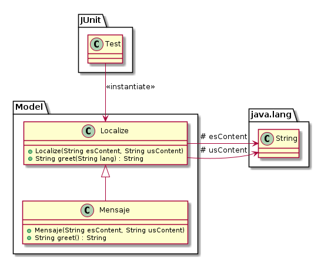

# Desarrollo

Este documento presenta una guía para los desarrolladores del proyecto.

## Configuración del ambiente

Existen distintas maneras de configurar el ambiente de desarrollo:

- [Nativo](./Nativo.md)
- [Docker](./Docker.md)

## Diagramas

[Plantuml](https://plantuml.com/) soporta un mecanísmo que les facilitará la generación y posterior mantenimiento de los diagramas de clase, secuencia, estado y paquetes. Para mayor información referir [guía de PlantUML](./PlantUML.md)

### Paquetes



## Empaquetado

Cuando se genera un **tag** que comienza con `v` (ejemplo `v0.0.1`) automáticamente se produce un [release](https://github.com/fiuba/algo3_proyecto_base_tp2/releases) con la aplicación empaquetada. Para el nombre de la versión se recomienda utilizar [versionado semántico](https://semver.org/lang/es/), por ejemplo:

```bash
$ git tag v0.0.1   # Genera el tag sobre el commit actual
$ git push --tags  # Pushea el tag al repo, iniciando el release automático
```

Para más información sobre cómo generar tags ver la [documentación de git](https://git-scm.com/book/es/v2/Fundamentos-de-Git-Etiquetado).

## Distribución

El archivo `.jar` generado en el release contiene la aplicación empaquetada y puede distribuirse. Luego puede ejecutarse en Windows, Mac o Linux con:

```bash
$ java -jar <archivo.jar>
```

## Seguridad

Al pushear el código al repositorio este es analizado con [CodeQL](https://codeql.github.com/docs/). Si se encuentra algún error o vulnerabilidad se mostrará en la pestaña Security -> [Code scanning alerts](https://github.com/fiuba/algo3_proyecto_base_tp2/security/code-scanning). Luego de que dicho error sea arreglado la alerta se resuelve de forma automática, para más información consultar la [documentación de github](https://docs.github.com/en/code-security/secure-coding/automatically-scanning-your-code-for-vulnerabilities-and-errors).
